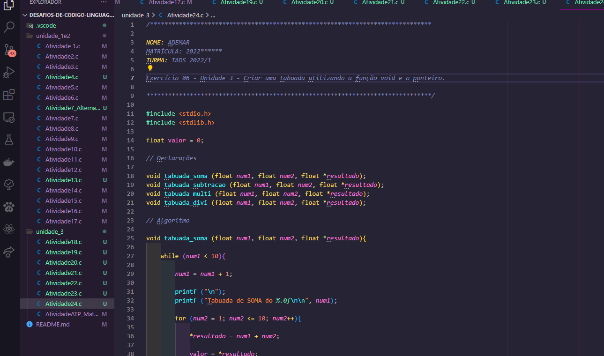

# Desafios de Código e Lógica de Programação

Este projeto contém uma coleção de desafios de código e lógica de programação desenvolvidos durante a disciplina de Algoritmos e Técnicas de Programação. Cada desafio representa um problema específico que requer habilidades de programação para serem resolvidos.

## Imagem do Projeto

## Explicação dos Desafios

### Desafio 1: Dados Pessoais

O desafio consiste em solicitar ao usuário que insira seu nome, cidade de residência, sexo e data de nascimento (dia, mês e ano). Em seguida, o programa calcula a idade atual do usuário com base no ano de nascimento fornecido e exibe todas as informações coletadas.

### Desafio 2: Cálculo de Expressão

Neste desafio, é necessário calcular o valor da expressão matemática `x = b / a`, onde `a` é igual a 78 e `b` é igual a -9. O programa realiza o cálculo e exibe o valor resultante de `x`.

### Desafio 3: Cálculo de Imposto

O objetivo deste desafio é calcular o valor do imposto (ICMS) a ser pago em dois estados diferentes, Amazonas e Pará. O usuário deve inserir o valor de um produto e o programa calcula o imposto correspondente em cada estado, considerando as taxas de 18% para o Amazonas e 17% para o Pará.

### Desafio 4: Classificação por Idade e Sexo

Neste desafio, o programa solicita ao usuário que informe seu sexo (masculino ou feminino) e sua idade. Com base nessas informações, o programa classifica o usuário em uma das seguintes categorias: "Infantil Masculino", "Infantil Feminino", "Juvenil Masculino", "Juvenil Feminino", "Adulto Masculino" ou "Adulto Feminino". A categoria é determinada de acordo com o sexo e a faixa etária do usuário.

### Desafio 5: Contagem de Dias de Aula

O desafio consiste em exibir uma contagem dos dias de aula, de 1 a 10. O programa utiliza um loop for para iterar sobre os números e exibir cada dia de aula na saída.

### Desafio 6: Números Anteriores e Posteriores

O objetivo deste desafio é solicitar ao usuário que insira um número inteiro maior que zero. O programa então exibe os 10 números anteriores e os 10 números posteriores ao número fornecido.

### Desafio 7 - Imprimir números de 1 a 100, 10 por linha

Neste desafio, o objetivo é imprimir os números de 1 a 100, sendo que apenas 10 números devem ser exibidos por linha.

O código começa declarando a variável `num` e inicializando-a com o valor 1. Em seguida, imprime uma linha vazia no console usando `printf("\n")`.

A estrutura condicional `if` verifica se `num` está no intervalo de 1 a 100 (0 < num < 100). Isso é feito para garantir que o loop while execute apenas se a condição for verdadeira.

Dentro do loop `while`, a função `printf` é usada para imprimir 10 números por linha, usando o formato `%4d` para cada número. O número `num` e os 9 números seguintes (num + 1, num + 2, ..., num + 9) são impressos na mesma linha. O código então incrementa `num` em 10, ou seja, `num += 10`, para prosseguir para a próxima linha.

O loop continua até que `num` seja maior que 100, encerrando a impressão.

### Desafio 8 - Imprimir uma matriz diagonal 2x2 com "1" na diagonal principal e "0" nas outras posições

Neste desafio, o objetivo é imprimir uma matriz 2x2 com "1" na diagonal principal e "0" nas outras posições.

#### Código 1:
O primeiro código utiliza dois loops `for` para percorrer as linhas (variável `i`) e colunas (variável `j`) da matriz. Para cada posição (i, j), se `i` for igual a `j`, imprime "1", caso contrário, imprime "0". O resultado é uma matriz diagonal de "1"s.

#### Código 2:
O segundo código utiliza dois loops `for` para percorrer as linhas (variável `i`) e colunas (variável `j`) da matriz. A matriz não é declarada ou armazenada, o que significa que não há uma matriz real sendo criada e preenchida. Em vez disso, o código imprime os valores diretamente no console, sem armazená-los em uma estrutura de dados.

O código imprime as coordenadas de cada posição da matriz formatadas como "(i, j)", onde i é o índice da linha e j é o índice da coluna. Como resultado, é impressa uma lista de coordenadas (1,1), (1,2), ..., (10, 20) correspondendo a uma matriz de 10x20, mas não é a matriz diagonal desejada.

#### Código 3:
O terceiro código também utiliza dois loops `for` para percorrer as linhas (variável `i`) e colunas (variável `j`) da matriz. A condição `if` dentro do loop verifica se `j` é igual a 1 ou 5. Se for verdadeiro, imprime "1", caso contrário, imprime "0". O resultado é uma matriz diagonal de "1"s nas primeiras e últimas colunas e "0"s nas colunas intermediárias.

Note que, para obter a matriz diagonal 2x2 desejada (com "1" na diagonal principal e "0" nas outras posições), o código correto deve ser o primeiro, que realmente cria e preenche uma matriz com os valores corretos. Os outros dois códigos não produzem a matriz desejada.

Peço desculpas pela confusão. Abaixo estão apenas as explicações dos desafios, conforme solicitado:

### Desafio 11 - Verificação de senha com contagem de tentativas

Neste desafio, o programa solicita ao usuário que digite uma senha e verifica se ela corresponde a uma senha pré-definida (123). O usuário tem até 5 tentativas para acertar a senha correta. Se a senha estiver correta antes das 5 tentativas, o programa exibirá "Acesso autorizado!". Caso contrário, após as 5 tentativas, o programa exibirá "Acesso bloqueado!".

### Desafio 12 - Sequência de Fibonacci em uma posição específica

Neste desafio, o programa pede ao usuário que escolha uma posição na sequência de Fibonacci. Em seguida, o programa calculará o valor correspondente da sequência e o exibirá no console. O cálculo é feito por meio de uma função chamada `fibonacci(n)`.

### Desafio 13 - Cálculo do fatorial

Neste desafio, o programa solicita ao usuário que insira um número inteiro. Em seguida, o programa calculará o fatorial desse número e o exibirá no console. O fatorial de um número é o produto de todos os números inteiros positivos menores ou iguais a ele.

### Desafio 14 - Soma iterativa de números

Neste desafio, o programa pede ao usuário que digite dois números inteiros. Ele calcula a soma iterativa desses dois números, mostrando cada etapa da soma no console. O cálculo é feito por meio de um loop `while`, onde o número menor é somado ao resultado repetidamente até que o número de iterações iguale o número menor.

### Desafio 15 - Verificação de login e senha

Neste desafio, o programa solicita ao usuário que digite um login e uma senha. Em seguida, compara esses valores com um login e senha pré-definidos (MEU_LOGIN e MINHA_SENHA, respectivamente). Se o login e a senha digitados pelo usuário coincidirem com os valores pré-definidos, o programa exibe "Logado". Caso contrário, exibe "error".

### Desafio 16 - Menu de opções com login e senha

Neste desafio, o programa apresenta um menu de opções com as seguintes funcionalidades:

1. Acessar login e senha: O usuário pode tentar fazer login digitando uma senha. Ele tem até 3 tentativas para acertar a senha correta (1234, neste caso). Se acertar, o programa exibe "Acesso concedido"; caso contrário, exibe "Acesso negado" após as 3 tentativas.

2. Trocar senha: O usuário pode trocar sua senha digitando uma nova senha (inteira) para substituir a senha atual (1234).

3. Sair: O usuário pode escolher sair do programa, encerrando a execução.

O programa continua apresentando o menu de opções até que o usuário escolha a opção "Sair".

### Desafio 17 - Sistema de comandas

Neste desafio, o programa simula um sistema de comandas, onde o usuário pode registrar produtos com seus respectivos preços e quantidades. O programa apresenta um menu de opções com as seguintes funcionalidades:

1. Declarar nome do produto, quantidade e valor por unidade: O usuário pode adicionar produtos à comanda, informando o nome do produto, a quantidade adquirida e o valor por unidade. O programa calcula o total da compra somando o valor de cada produto registrado.

2. Fechar a comanda: O usuário pode escolher encerrar a comanda e o programa exibe o valor total da compra.

3. Sair: O usuário pode escolher sair do programa, encerrando a execução.

O programa continua apresentando o menu de opções até que o usuário escolha a opção "Sair".

### Desafio 18 - Calculadora básica

Neste desafio, o programa apresenta uma calculadora básica, onde o usuário pode inserir dois números e realizar operações matemáticas como soma, subtração, multiplicação e divisão. O programa utiliza funções para realizar as operações matemáticas e exibe os resultados no console.

### Desafio 19 - Variáveis Globais e Locais

Neste desafio, o programa apresenta um exemplo de variáveis globais e locais. As variáveis globais são declaradas fora de qualquer função e podem ser acessadas por todas as funções do programa. No exemplo, a variável `vg` é uma variável global que possui o valor 2.

As funções `fun1` e `fun2` são exemplos de funções com variáveis locais. As variáveis locais são declaradas dentro das funções e só podem ser acessadas dentro do escopo em que foram declaradas. As variáveis locais `vf1` e `vf2` só existem dentro de suas respectivas funções (`fun1` e `fun2`).

O programa chama as funções `fun1` e `fun2` passando uma variável `vm` como argumento. `vm` é uma variável local definida na função `main`.

O programa imprime o valor retornado pelas funções `fun1` e `fun2`, que são 1 e 2, respectivamente.

### Desafio 20 - Operações Matemáticas Básicas

Neste desafio, o programa apresenta quatro funções matemáticas básicas: soma, subtração, multiplicação e divisão. Cada função é definida para realizar a operação correspondente entre dois números reais e retornar o resultado.

O programa oferece um menu de opções onde o usuário pode escolher entre as quatro operações. Ao escolher uma opção, o usuário deve inserir os números que deseja operar, e o resultado da operação é exibido no console.

### Desafio 21 - Passagem de Parâmetro por Referência

Neste desafio, o programa ilustra a passagem de parâmetros por referência, onde os endereços das variáveis são passados como argumentos para as funções, permitindo que as funções modifiquem o valor das variáveis originais.

A função `aumenta_salario` recebe um prêmio e um ponteiro para a variável `valor_para_pagamento`, que é um ponteiro para o valor total do pagamento do salário. A função aumenta o salário com base no prêmio recebido e atualiza o valor da variável `total_pagamento_salario` na função `main` através do ponteiro.

### Desafio 22 - Passagem de Parâmetros por Referência (Exercício)

Neste desafio, o programa apresenta três funções para realizar operações matemáticas básicas (soma e subtração). As funções recebem os valores dos números a serem operados e um ponteiro para a variável `total`, onde o resultado da operação será armazenado.

O programa utiliza as funções `somar` e `exibirvalor` para subtrair 7 de 5 e exibir o resultado (-2) no console. A função `somar` recebe os valores 5 e 7, realiza a operação de subtração e armazena o resultado na variável `valor` através do ponteiro. Em seguida, a função `exibirvalor` é chamada para mostrar o resultado no console.

### Desafio 23 - Manipulação de Vetores

Neste desafio, o programa apresenta quatro opções no menu:

1. Preencher um vetor de tamanho 200 com números reais maiores que 800.
2. Preencher um vetor de tamanho 50 com números inteiros aleatórios.
3. Realizar a soma entre duas matrizes 10x10 de inteiros, preenchidas com números aleatórios, e exibir o resultado.
4. Definir uma matriz 5x5 de inteiros, solicitar do usuário a quantidade de elementos e preencher automaticamente a matriz da forma descrita no slide.

O desafio 16 utiliza os conceitos de manipulação de vetores e matrizes. Nas opções 1 e 2, o programa preenche o vetor automaticamente e exibe os valores. Nas opções 3 e 4, o programa preenche a matriz com valores aleatórios e realiza a operação solicitada. O menu permite ao usuário escolher as operações desejadas.

### Desafio 24 - Criando uma tabuada com funções e ponteiros

Neste desafio, o objetivo é criar um programa em C que gera uma tabuada utilizando funções e ponteiros. Vamos criar um menu interativo que permitirá ao usuário escolher entre quatro operações matemáticas: soma, subtração, multiplicação e divisão. Para cada operação selecionada, o programa irá exibir a tabuada do número escolhido até o número 10.

**Implementação:**

1. Começamos definindo quatro funções: `tabuada_soma`, `tabuada_subtracao`, `tabuada_multi` e `tabuada_divi`. Cada função recebe dois números como parâmetros (`num1` e `num2`) e um ponteiro `*resultado`. Essas funções são responsáveis por calcular a tabuada da operação escolhida e armazenar o resultado na variável apontada pelo ponteiro `*resultado`.

2. Para cada operação, utilizamos um loop `while` para iterar sobre o primeiro número (`num1`) e realizar as operações até o número 10.

3. Na função `main`, criamos um menu com cinco opções: Soma, Subtração, Multiplicação, Divisão e Sair. O usuário pode escolher uma das quatro operações ou sair do programa.

4. De acordo com a escolha do usuário, chamamos a função correspondente (`tabuada_soma`, `tabuada_subtracao`, `tabuada_multi` ou `tabuada_divi`) passando os valores adequados.

5. Utilizamos ponteiros para atualizar a variável `valor`, que armazena o resultado das operações, e, em seguida, exibimos a tabuada no console.

**Objetivo:**

O objetivo deste desafio é praticar o uso de funções e ponteiros em C, criando um programa modular e eficiente para gerar tabuadas de diferentes operações matemáticas. Além disso, aprenderemos a criar um menu interativo para que o usuário possa selecionar as operações desejadas.

**Observações:**

- As tabuadas geradas pelo programa são limitadas até o número 10.
- Cada função calcula a tabuada do número escolhido e atualiza a variável `valor`, que será exibida no final.

### Desafio 25 - Manipulação de Vetores e Matrizes em C

Neste desafio, desenvolvi um programa em C que realiza diversas operações com vetores e matrizes. Vou explicar cada uma delas:

**Case 1: Vetor de tamanho 200**

- Neste caso, criei um vetor chamado "vetor" com 200 posições e preenchi-o com números reais começando em 801. Ou seja, na posição 0 do vetor temos o valor 801, na posição 1 temos 802, e assim por diante, até a posição 199 com o valor 1000. Em seguida, exibi o conteúdo do vetor na tela.

**Case 2: Vetor de tamanho 50**

- Neste caso, criei um vetor chamado "vetor" com 50 posições e preenchi-o com números inteiros aleatórios. Cada número foi gerado de forma aleatória usando a função "rand()" da biblioteca "stdlib.h". Os valores dos números inteiros gerados são exibidos na tela.

**Case 3: Matrizes e Soma**

- Neste caso, criei duas matrizes 10x10 chamadas "matrizA" e "matrizB". Cada elemento dessas matrizes foi preenchido com um número inteiro aleatório entre 0 e 9 usando a função "rand() % 10". Em seguida, realizei a soma entre as duas matrizes, elemento a elemento, armazenando o resultado em uma terceira matriz chamada "somaAB". Por fim, exibi o conteúdo das três matrizes na tela.

**Case 4: Matriz Personalizada**

- Neste caso, o programa solicita ao usuário que digite a quantidade de elementos que deseja para preencher a matriz. A matriz tem tamanho 5x5 e é preenchida com números inteiros sequenciais começando em 1. No entanto, o programa verifica se o número da sequência é menor ou igual à quantidade de elementos fornecida pelo usuário. Caso seja, o valor é exibido na matriz; caso contrário, é exibido um espaço vazio. No final, o programa mostra a matriz personalizada na tela.

**Menu e Operações**

- O programa apresenta um menu com cinco opções, permitindo que o usuário escolha qual operação deseja realizar: preencher um vetor com números reais maiores que 800, preencher um vetor com números inteiros aleatórios, criar matrizes e realizar a soma entre elas, ou criar uma matriz personalizada com quantidade de elementos definida pelo usuário. A opção 5 permite sair do programa.

**Objetivo:**

O objetivo deste desafio foi praticar o uso de vetores e matrizes em C e manipular seus elementos através de loops e estruturas de controle. Além disso, o programa também apresentou um menu interativo que permite ao usuário escolher a operação que deseja executar.

**Observações:**

- Os números gerados aleatoriamente podem variar cada vez que o programa é executado, pois são baseados no valor retornado pela função "rand()".
- Caso o usuário digite uma quantidade de elementos maior que 25 no Case 4, a matriz personalizada não será exibida corretamente, pois ela é limitada a 5x5.

## Instruções de Compilação e Execução

1. Certifique-se de ter um compilador C instalado em seu sistema.
2. Abra o terminal e navegue até o diretório onde os arquivos do projeto estão localizados.
3. Compile o código-fonte digitando o seguinte comando: `gcc projeto.c -o projeto`
4. Execute o programa digitando o seguinte comando: `./projeto`
5. Siga as instruções exibidas na tela para interagir com os algoritmos implementados.

Certifique-se de ter as bibliotecas `stdio.h`, `locale.h` e `math.h` instaladas em seu ambiente de desenvolvimento.

**Observação:** Este projeto foi desenvolvido como parte de um curso acadêmico e tem como objetivo educacional.
